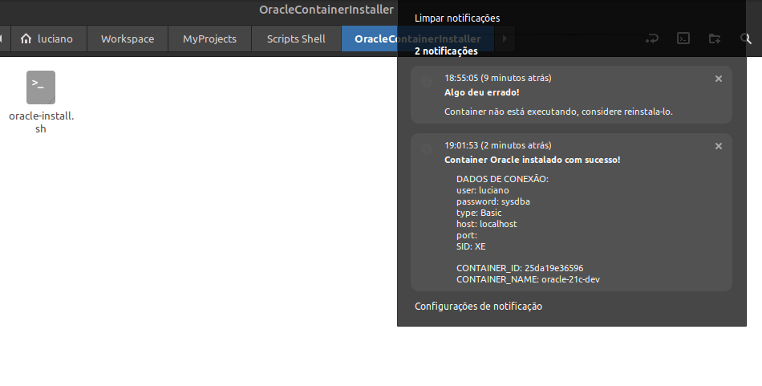

# Oracle Docker Installer




## Description

O oracle-docker-install.sh é uma ferramenta para a instalação e configuração do Docker e Oracle Databases via container Docker.


## Execution

Para utilizar a ferramenta basta baixar, abrir um terminal no diretório do script e executar com os seguintes comandos:
```
sudo chmod +x oracle-docker-install.sh
./oracle-docker-install.sh
```

Ou, se preferir, pode usar a própria interface do sistema operacional para dar permissão de execução e dois cliques sobre o arquivo para executar.


## Contributors

[Luciano Brito](https://github.com/lucianobritodev)

Brasileiro, casado, nascido em 1991, apaixonado por tecnologia. Graduado em Análise e Desenvolvimento de Sistemas pela Universidade Paulista(UNIP) em 2019 e pós graduado pela Infnet em 2023 em Arquitetura de Software.


## Contacts

- [LinkeIn](https://www.linkedin.com/in/luciano-brito-dev)
- [Gmail](mailto:lucianobrito.dev@gmail.com)
- [Instagram](https://www.instagram.com/lucianobrito.dev)


## Donates

[](https://www.paypal.com/donate/?hosted_button_id=SX3L4N89M8ZRW)